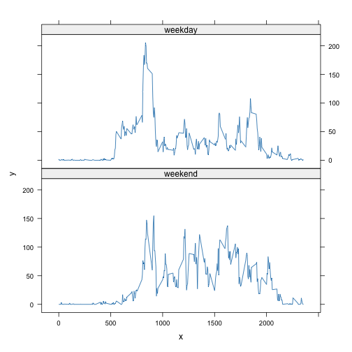

## Load required packages

```r
library(dplyr)
library(lattice)
```

## Loading and preprocessing the data
Load the data using `read.csv()` and take a peek using head()


```r
step_data <- read.csv("activity.csv")
head(step_data, 10)
```

```
##    steps       date interval
## 1     NA 2012-10-01        0
## 2     NA 2012-10-01        5
## 3     NA 2012-10-01       10
## 4     NA 2012-10-01       15
## 5     NA 2012-10-01       20
## 6     NA 2012-10-01       25
## 7     NA 2012-10-01       30
## 8     NA 2012-10-01       35
## 9     NA 2012-10-01       40
## 10    NA 2012-10-01       45
```

```r
dim(step_data)
```

```
## [1] 17568     3
```


Check the class of each column


```r
sapply(step_data, class)
```

```
##       steps        date    interval 
##   "integer" "character"   "integer"
```


The date column is encoded as character, so transform it into date format


```r
step_data$date <- as.Date(step_data$date, format="%Y-%m-%d")
head(step_data, 10)
```

```
##    steps       date interval
## 1     NA 2012-10-01        0
## 2     NA 2012-10-01        5
## 3     NA 2012-10-01       10
## 4     NA 2012-10-01       15
## 5     NA 2012-10-01       20
## 6     NA 2012-10-01       25
## 7     NA 2012-10-01       30
## 8     NA 2012-10-01       35
## 9     NA 2012-10-01       40
## 10    NA 2012-10-01       45
```

```r
class(step_data$date[1])
```

```
## [1] "Date"
```


## What is the mean total number of steps taken per day?

__Calculate the total number of steps taken per day__


```r
totalSteps <- step_data %>% group_by(date) %>% summarise(total.steps = sum(steps, na.rm=TRUE))
head(totalSteps, 10)
```

```
## # A tibble: 10 × 2
##    date       total.steps
##    <date>           <int>
##  1 2012-10-01           0
##  2 2012-10-02         126
##  3 2012-10-03       11352
##  4 2012-10-04       12116
##  5 2012-10-05       13294
##  6 2012-10-06       15420
##  7 2012-10-07       11015
##  8 2012-10-08           0
##  9 2012-10-09       12811
## 10 2012-10-10        9900
```


__Create a histogram of the total number of steps taken each day__


```r
hist(totalSteps$total.steps,
     breaks=10,
     xlab = "Total number of steps per day",
     main = "Histogram of the total number of steps per day",
     col = "magenta"
     )
```


__Calculate and report the mean and median of the total number of steps taken per day__


```r
meanSteps <- mean(totalSteps$total.steps, na.rm=T)
medianSteps <- median(totalSteps$total.steps, na.rm=T)
```

The mean number of steps taken is 9354

The median number of steps taken is 10395

## What is the average daily activity pattern?

__Make a time series plot (i.e. type="l") of the 5-minute interval (x-axis) and
the average number of steps taken, averaged across all days (y-axis)__

First aggregate the data, grouping by the interval and then taking the mean of
the steps in that interval


```r
intervalAverage <- step_data %>%
                   group_by(interval) %>%
                   summarise(mean.steps = mean(steps, na.rm=T))
head(intervalAverage, 10)
```

```
## # A tibble: 10 × 2
##    interval mean.steps
##       <int>      <dbl>
##  1        0     1.72  
##  2        5     0.340 
##  3       10     0.132 
##  4       15     0.151 
##  5       20     0.0755
##  6       25     2.09  
##  7       30     0.528 
##  8       35     0.868 
##  9       40     0     
## 10       45     1.47
```

Plot the new dataset


```r
with(intervalAverage, plot(interval, mean.steps,
                           type="l",
                           lwd=2,
                           col="red",
                           main = "Mean steps per interval",
                           xlab = "Time (s)",
                           ylab = "Mean steps (number)"))
```


__Which 5-minute interval, on average across all days in the dataset, contains
the maximum number of steps?__

Find the maximum number of steps in the averaged data, then index the data frame
by that row number


```r
maxInterval <- intervalAverage$interval[which(intervalAverage$mean.steps == max(intervalAverage$mean.steps, na.rm=T))]
```

The interval with the maximum number of steps is 835

## Imputing missing values
Missing values are coded here as NA

__Calculate and report the total number of missing values in the dataset (i.e.
the total number of rows with NAs)__


```r
missingValues <- is.na(step_data$steps)
numberMissing <- sum(missingValues)
```

The total number of missing records is 2304

__Devise a strategy for filling in all of the missing values in the dataset.
The strategy does not need to be sophisticated. For example, you could use
the mean/median for that day, or the mean for that 5-minute interval, etc.__

We'll replace the missing values with the median value for that interval

__Create a new dataset that is equal to the original dataset but with the
missing data filled in.__

Copy the dataset and create a column of median steps for each interval
Replace missing values with their interval median
Drop the median column again to tidy up


```r
imputed_step_data <- step_data %>% group_by(interval) %>% mutate(int_median = median(steps, na.rm=T))
imputed_step_data$steps[missingValues] <- imputed_step_data$int_median[missingValues]
imputed_step_data <- select(imputed_step_data, -int_median)
```

Check that the imputation has filled the NAs with expected values


```r
head(imputed_step_data, 10)
```

```
## # A tibble: 10 × 3
## # Groups:   interval [10]
##    steps date       interval
##    <int> <date>        <int>
##  1     0 2012-10-01        0
##  2     0 2012-10-01        5
##  3     0 2012-10-01       10
##  4     0 2012-10-01       15
##  5     0 2012-10-01       20
##  6     0 2012-10-01       25
##  7     0 2012-10-01       30
##  8     0 2012-10-01       35
##  9     0 2012-10-01       40
## 10     0 2012-10-01       45
```

```r
newMissingValues <- is.na(imputed_step_data$steps)
newNumMissing <- sum(newMissingValues)
```

The number of values now missing is 0

__Make a histogram of the total number of steps taken each date and calculate
and report the mean and median total number of steps taken per day. Do these
values differ from the estimates from the first part of the assignment? What
is the impact of imputing missing data on the estimates of the total daily
number of steps?__
   
Repeat the processes above, but with the new dataset


```r
totalStepsImputed <- imputed_step_data %>% group_by(date) %>% summarise(total.steps = sum(steps, na.rm=TRUE))
head(totalStepsImputed, 10)
```

```
## # A tibble: 10 × 2
##    date       total.steps
##    <date>           <int>
##  1 2012-10-01        1141
##  2 2012-10-02         126
##  3 2012-10-03       11352
##  4 2012-10-04       12116
##  5 2012-10-05       13294
##  6 2012-10-06       15420
##  7 2012-10-07       11015
##  8 2012-10-08        1141
##  9 2012-10-09       12811
## 10 2012-10-10        9900
```

```r
hist(totalStepsImputed$total.steps,
     breaks=10,
     xlab = "Total number of steps per day",
     main = "Histogram of the total number of steps per day",
     col = "magenta"
     )
```


```r
meanStepsImputed <- mean(totalStepsImputed$total.steps, na.rm=T)
medianStepsImputed <- median(totalStepsImputed$total.steps, na.rm=T)
```
The mean number of steps taken after imputation is 9504,
which is slightly higher than 9354 calculated
previously.

The median number of steps taken after imputation is 10395,
which is the same as 10395 calculated previously.

Imputing the missing data has had relatively little impact on the estimates of
the daily step total. This is expected since the proportion of missing values
was low (2304 out of 17568, or 0.13%)

## Are there differences in activity patterns between weekdays and weekends?

__Create a new factor variable in the dataset with two levels - "weekday" and
"weekend" - indicating whether a given date is a weekday or a weekend day.__

Perform in stages of mutate, first applying the weekdays() function to convert
from date to day, then converting to a boolean based on weekend day names, and
finally convert to a factor with the desired levels


```r
imputed_step_data <- imputed_step_data %>%
    mutate(day.type = weekdays(date),
           day.type = day.type %in% c("Saturday", "Sunday"),
           day.type = factor(day.type,
                             levels = c(TRUE, FALSE),
                             labels = c("weekend", "weekday")))
head(imputed_step_data, 10)
```

```
## # A tibble: 10 × 4
## # Groups:   interval [10]
##    steps date       interval day.type
##    <int> <date>        <int> <fct>   
##  1     0 2012-10-01        0 weekday 
##  2     0 2012-10-01        5 weekday 
##  3     0 2012-10-01       10 weekday 
##  4     0 2012-10-01       15 weekday 
##  5     0 2012-10-01       20 weekday 
##  6     0 2012-10-01       25 weekday 
##  7     0 2012-10-01       30 weekday 
##  8     0 2012-10-01       35 weekday 
##  9     0 2012-10-01       40 weekday 
## 10     0 2012-10-01       45 weekday
```

__Make a panel plot containing a time series plot (i.e. type = "l") of the
5-minute interval (x-axis) and the average number of steps taken, averaged
across all weekend days (y-axis).__

Create a summarised dataset with the interval steps averaged by day type


```r
imputed_avs <- imputed_step_data %>%
               group_by(interval, day.type) %>% 
               summarise(stepav = mean(steps))
```

```
## `summarise()` has grouped output by 'interval'. You can override using the `.groups` argument.
```

Plot using the lattice package


```r
x <- imputed_avs$interval
y <- imputed_avs$stepav
f <- imputed_avs$day.type
xyplot(y ~ x | f, layout = c(1, 2), type = "l")
```


